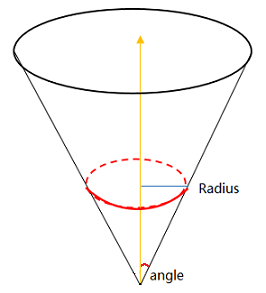
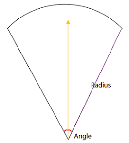
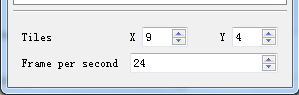
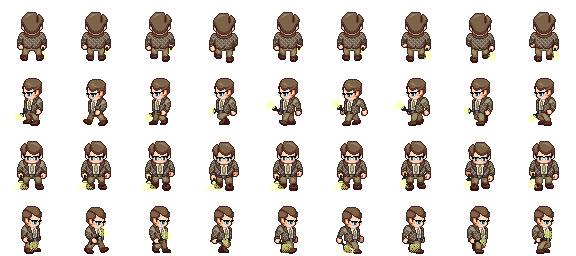
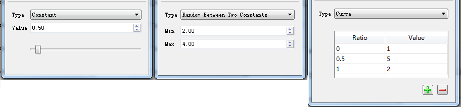
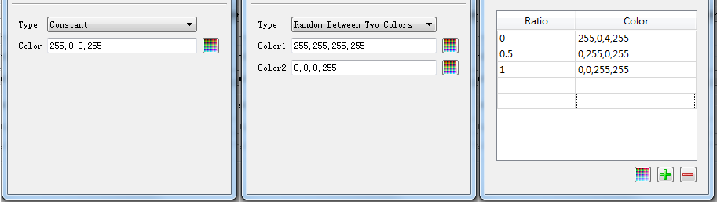

# 粒子系统使用说明 #

## 编辑器 ##

界面主要上下两部分组成，上面列出当前粒子系统的所有可配置的参数，当点击相应参数时，下面会出现对应控件，可以修改参数的值。

参数可分为四类：

- Particle System，系统参数
- Emitter，发射器参数
- Affector，影响器（效果器）参数
- Render，渲染参数

## 系统参数 ##

- Max particle：可同时存在的最大粒子数目

## 发射器 ##

一个粒子产生时具有大小、位置、颜色、速度、生存时间等初始属性，这些属性的值由发射器来决定，不同类型的发射器可以产生具有不同属性的粒子。  
按形状划分，目前已经实现的发射器有以下两个：

- Point
- Circle

发射器可配置的属性如下：

- Emission Rate：发射速率，每秒中发射的粒子个数
- Emit from：发射粒子的位置
- Angle：发射器的角度
- Radius：发射器的半径
- Velocity：粒子的速度
- Time to live：粒子的生存时间
- Scale：粒子的大小
- Start color：粒子的颜色

#### Point ####

圆锥体，Angle 和 Radius 如下图所示。
> 类似 Unity 中 [Shape module](https://docs.unity3d.com/Manual/PartSysShapeModule.html) 的 Cone。

当半径（Radius）等于 0 的时候，所有粒子将从圆锥体的顶点向外发射。  
Point 类型的发射器发射粒子的位置（Emit from）有四种选择，分别为 Base、Base Shell、Volume、Volume Shell，默认为 Base。

#### Circle ####

扇形，Angle 和 Radius 如下图所示。
> 类似 Unity 中 [Shape module](https://docs.unity3d.com/Manual/PartSysShapeModule.html) 的 Circle。

Circle 类型的发射器发射粒子的位置（Emit from）有四种选择，分别为 Base、Volume、Edge，默认为 Base。

## 影响器（效果器） ##

当一个粒子诞生时，它的大小、颜色等参数都是固定的，如果想实现在粒子的生命周期中，大小、颜色等参数可动态改变，就要用到影响器的功能了。  
目前已实现的影响器有三个，可通过编辑器顶部的按钮创建，如下：

- Scale
- Color
- Animator

#### Scale ####

可以实现粒子的大小在其生命周期中动态变化。

#### Color ####

可以实现粒子的颜色在其生命周期中动态变化。

#### Animator ####

使用 Animator 可以使粒子拥有可动态变化的外观，可用来实现帧动画。配置界面如下：

Tiles 用来设置纹理中 X 和 Y 方向子纹理的数量，如下图 X = 9，Y = 4.

设置完帧率（fps）之后，粒子的外观会从左上角纹理按行序每一帧发生变化。

## 渲染参数 ##

- Texture：当前粒子使用的纹理图片   
  
> 1. 要求 png 格式
> 2. 只有当前 effect 文件夹中的图片才可以被选择（*.ofeffect 同级目录）
> 3. 建议图片长宽相同，如128*128

- Blend Mode：混合模式

## 基本控件的使用方法 ##

粒子系统有很多属性，其值主要有两种，一种是数值类型，比如速度（Velocity）和半径（Radius），用一个数字既可以表达；一种是颜色类型，比如初始颜色（Start color）和 Color Affector 的参数，其值是用 RGBA 四个分量表达的颜色。针对这两种类型，在编辑器中实现了相应的控件。

### 数值控件 ###

界面如下，从左到右依次表达三种类型。

- Constant，常量
- Random Between Two Constant，随机变量，在指定的 Min 和 Max 中间随机取值
- Curve，曲线变量，按指定的控制点线性插值

这里特别说明一下 Curve 类型的变量，见上面最右边的图中所示，Curve 类型的变量采用一个两列的表格来定义，第一列代表粒子已存活时间和总的存活时间的比例，取值在 [0, 1] 之间，比如 0 代表粒子刚诞生，1 代表粒子消亡。如果上面最右边的图中表达的是 Scale Affector 的设置，其含义是粒子的大小（Scale）先从 1 渐增到 5，之后渐减到 2。

### 颜色控件 ###

界面如下，从左到右依次表达三种类型。

- Constant，固定一个颜色
- Random Between Two Colors，随机颜色，在指定的两个颜色中间随机取值（分别对 RGBA 四个分量随机取值）
- Curve，按指定的控制点线性插值

这里特别说明一下 Curve 类型的颜色，见上面最右边的图中所示，Curve 类型的变量采用一个两列的表格来定义，第一列代表粒子已存活时间和总的存活时间的比例，取值在 [0, 1] 之间，比如 0 代表粒子刚诞生，1 代表粒子消亡。如果上面最右边的图中表达的是 Color Affector 的设置，其含义是粒子的颜色（Color）先从红色（255，0，0）渐变到绿色（0，255，0），之后再渐变到蓝色（0，0，255），透明度一直是255，表示粒子始终保持不透明。

## 序列化 ##

    "max_particle_num": 50,
	"emitter": {
		"type": "point",
		"params": {
			"emission_rate": 50.0,
			"emission_place": 1,
			"velocity": 5.0,
			"time_to_live": 0.67,
			"scale": 2.6,
			"angle": 4.0,
			"radius": 4.0
		}
	},
	"affector": {
		"affector_count": 1,
		"affector_list": [{
			"type": "scale_over_lifetime",
			"params": {
				"scale": {
					"type": "curve_linear",
					"ctrl_point_count": 3,
					"ctrl_point": [0.0, 0.5, 0.4, 1.0, 1.0, 2.0]
					}
				}
			}
		]
	},
	"render": {
		"texture": "FireParticleSingleTexture.png"
		"blend_type": 0
	}